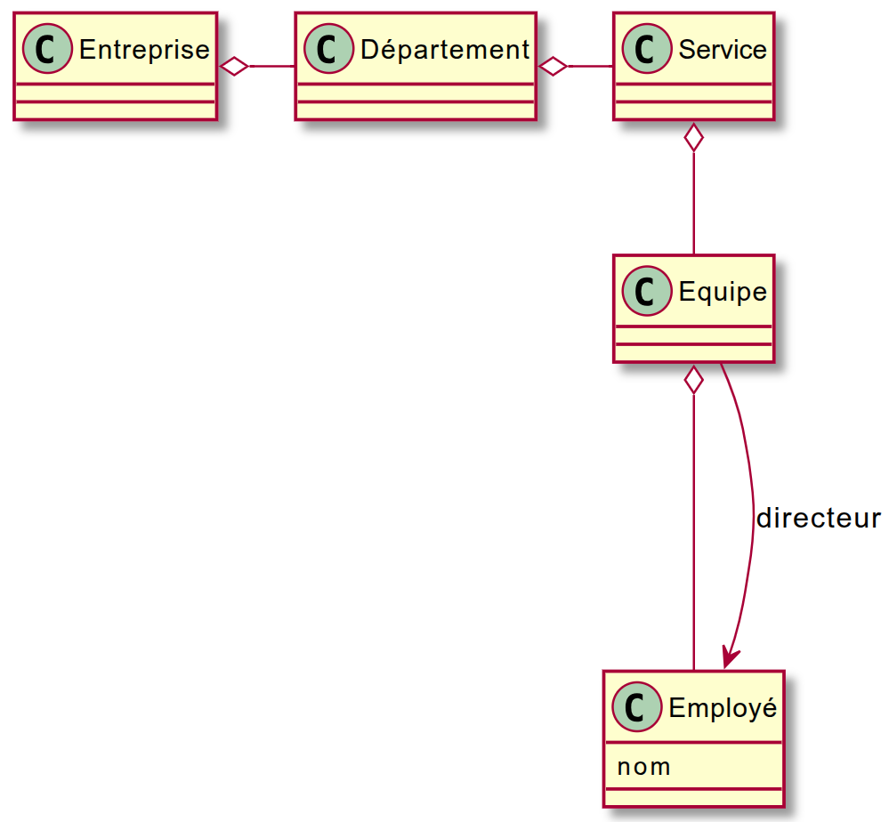
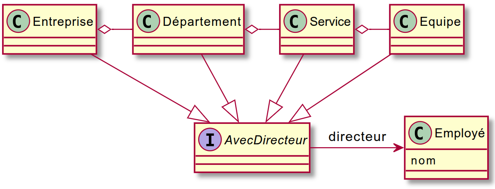

# Lab 3 — Object-Oriented Design Refresher


> Unlike labs 1–2, this lab has **no automated test suite**: you verify your
> work by running the `Main` classes and by code review. (The reference
> solution adds a few JUnit tests to prove the expected behavior.)

## Objective

Consolidate your **object-oriented programming** knowledge:
- reducing **coupling** between classes,
- respecting the **Law of Demeter**,
- applying **good software design** principles (interfaces, inverted
  dependencies, reusability).

## Exercise 1 — removing coupling

### Question 1 — reduce coupling with a logger (`exo1.q1`)

A computation program logs its steps for later verification. The current
implementation lives in package `exo1.q1.v1`.

But the `FileLogger` class used there makes unit tests hard to write and
maintain.

💭 **Analyze the problem**

- Are the exceptions thrown by the logger properly handled in the current code?
- Why does this approach make the software less flexible?

💡 **Work to do**

1. In package `exo1.q1.v2` (currently empty), create an **interface** to reduce
   coupling.
2. Provide **three implementations**:
   - `NullLogger` : does nothing (useful to disable logging)
   - `MemoryLogger` : stores messages in an `ArrayList<String>` (useful for tests)
   - `FileLogger` : keeps the initial behavior (writes to a file)
3. Change the computation code so it depends on the **interface**, no longer on
   a concrete class.
4. **Think**: who should instantiate the logger, and why?

### Question 2 — flexible catalogue export (`exo1.q2`)

We have a `Catalogue` class (a set of products) in package `exo1.q2.v1` that
can export its content as **XML** via an `XMLDumper` class.

But the coupling between `Catalogue` and `XMLDumper` is **too strong**:
`Catalogue` should not depend on one specific format.

💭 **Problem to solve**

- Why is `Catalogue` calling `XMLDumper` directly a problem?
- How to make this architecture extensible to other formats (JSON, YAML, …)?

💡 **Work to do**

1. Design an **abstraction** separating business logic (`Catalogue`) from the
   export format.
2. Implement at least two exporters:
   - `XMLDumper` : XML export (existing implementation adapted to the new interface)
   - `JSONDumper` : JSON export
3. (Optional, if you have time): add a `YAMLExporter`
   → remember to track the write depth with an instance variable.
4. Prove your architecture works by checking that switching formats requires
   **zero changes** to `Catalogue` code.

📘 Expected JSON example (indentation optional):

```json
{"@type":"catalogue",
    "contenu":[
        {"@type":"produit",
             "contenu":[
                    {"@type":"designation", "contenu":["texte":"souris"]},
                    {"@type":"prix", "contenu":["texte":"30.0"]}
                    ]
        },
        {"@type":"produit",
             "contenu":[
                    {"@type":"designation", "contenu":["texte":"ordi"]},
                    {"@type":"prix", "contenu":["texte":"600.0"]}
                    ]
        }
    ]
}
```

Run the demo: `exo1.q2.v1.Main` prints the catalogue as XML.

## Exercise 2 — Law of Demeter (`exo2`)

### Question 1 — understand and apply the Law of Demeter

The company architecture looks like this:



```plantuml
@startuml
class Employe { nom }
Entreprise o- Departement
Departement o- Service
Service o-- Equipe
Equipe o--- Employe
Equipe --> Employe : directeur
@enduml
```

A method in the program returns the list of **team-director names**
(`Entreprise.listeDirecteursDepartement`).

💭 **Reflection questions**

- Does this method respect the **Law of Demeter**?
- What are the symptoms of a Law-of-Demeter violation in the current code?
- What happens if the class hierarchy changes (extra level, renaming, …)?

💡 **Work to do**

- Refactor the method so it respects the Law of Demeter.
- Check the method still works after the change (`exo2.q1.Main`).

### Question 2 — generalize the notion of "being directed"

We then discover that **every entity** (company, department, service, team)
can have a **director**. The model becomes:



```plantuml
Interface AvecDirecteur
AvecDirecteur -> Employe : directeur
Entreprise o- Departement
Departement o- Service
Service o- Equipe
Entreprise --|> AvecDirecteur
Departement --|> AvecDirecteur
Service --|> AvecDirecteur
Equipe --|> AvecDirecteur
@enduml
```

💭 **Reflection**

- How to adapt your previous solution to this new hierarchy?
- Does your code still follow the **Law of Demeter**?
- Should you introduce an abstraction (interface, common method, or visitor)
  to handle all these entities uniformly?

💡 **Work to do**

- Refactor your code to include the `AvecDirecteur` notion.

## Exercise 3 — SOLID and refactoring (analysis, no code required)

- Walk through your code from the previous exercises.
- For each SOLID principle (**SRP, OCP, LSP, ISP, DIP**), identify one place
  where it is **respected** and one where it is **violated** (even slightly).
- Justify your answers, and propose **refactorings** for the violations.

## How to run (VS Code + JDK 11+, tested with JDK 25)

1. Open THIS folder (`lab3`, the one containing `pom.xml`) via
   `File > Open Folder`.
2. Install `Extension Pack for Java` (Microsoft), trust the workspace, wait
   for the Maven import.
3. Compile everything: `.\mvnw.cmd compile` (Windows) / `./mvnw compile`.
4. Run a demo from VS Code (`Run` above a `Main.main`) or from the terminal,
   e.g.:
   ```powershell
   .\mvnw.cmd compile exec:java -Dexec.mainClass="exo2.q1.Main"
   ```
   (needs `exec-maven-plugin`; simplest is VS Code's Run button.)

> Note: `pom.xml` targets Java 11 (original TP targeted Java 8; bumped so it
> compiles on modern JDKs — language features used are Java 8 compatible).
> `README.html` is the original French rendering, kept for reference.
> `monlog.txt` (created when you run the v1 logger demo) is git-ignored.

## Package map

| Package | Exercise | Status |
| --- | --- | --- |
| `exo1.q1.v1` | Ex1 Q1, coupled version | given (study it) |
| `exo1.q1.v2` | Ex1 Q1, decoupled version | **empty — you write it** |
| `exo1.q2.v1` | Ex1 Q2, XML-only version | given (study it) |
| `exo2.q1` | Ex2 Q1, Demeter violation | given (refactor it) |
